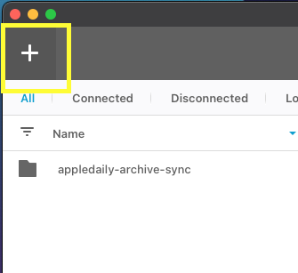
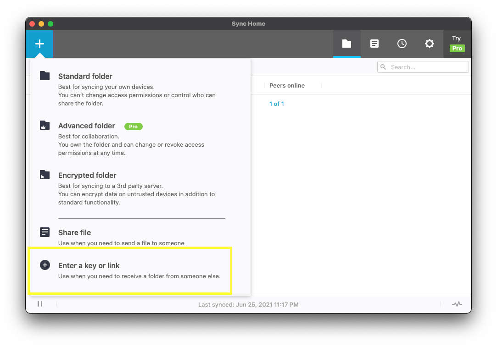
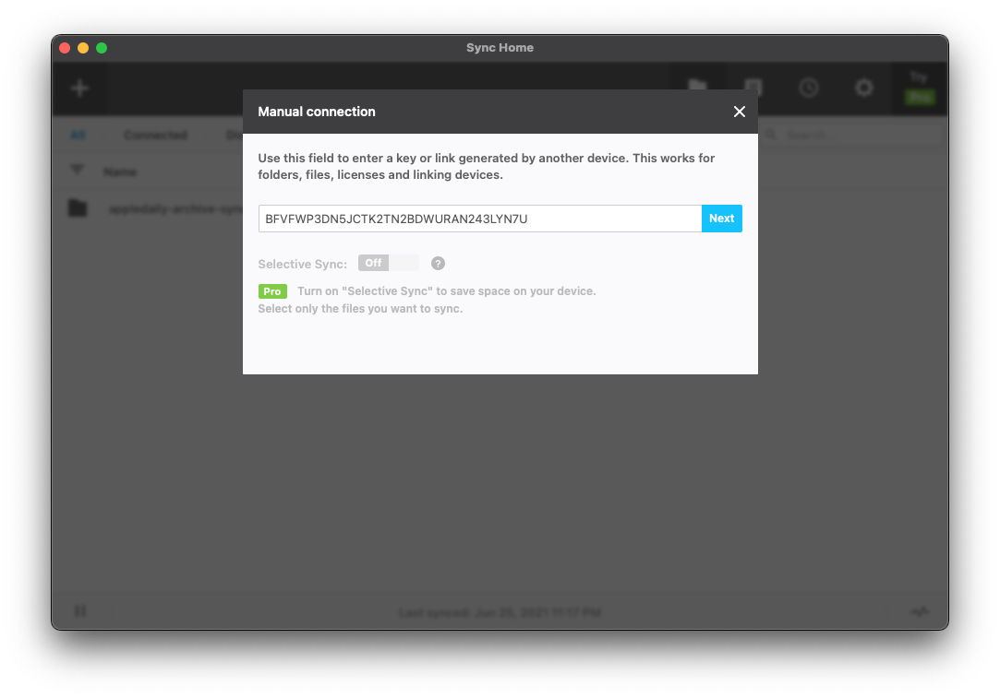

# 《蘋果日報》文字備份計劃

- [引言](#引言)
- [計劃定位及目標](#計劃定位及目標)
- [數據來源及內容](#數據來源及內容)
- [下載方法](#下載方法)
- [資料結構同元資料(metadata)](#資料結構同元資料metadata)
  - [`appledaily-article-json-backup-partial.zip`](#appledaily-article-json-backup-partialzip)
  - [`appledaily-html-backup-partial.zip`](#appledaily-html-backup-partialzip)
  - [`appledaily-html-plaintext-full.tar.bz2`](#appledaily-html-plaintext-fulltarbz2)
  - [`appledaily-images.zip`](#appledaily-imageszip)
  - [`appledaily-articles-json.zip`](#appledaily-articles-jsonzip)
  - [`apple-articles-plaintext-20020101-20210620.zip`](#apple-articles-plaintext-20020101-20210620zip)
  - [`appledaily-backup-metadata.zip`](#appledaily-backup-metadatazip)
- [聲明](#聲明)
- [FAQ](#faq)
  - [乜野係Resilio Sync？安唔安全？](#乜野係resilio-sync安唔安全)
  - [點解唔用XX](#點解唔用xx)
    - [點解唔用Dropbox/Google Drive/One Drive](#點解唔用dropboxgoogle-driveone-drive)
    - [點解唔用IPFS](#點解唔用ipfs)
- [寫在最後](#寫在最後)
- [其他資源](#其他資源)

## 引言

《蘋果日報》已經係2021年6月25日因涉嫌違反港區國安法而停刊。網絡上有唔少人都幫手將《蘋果日報》內容備份，我都想出一分力幫下手。

我之前backup左《蘋果日報》四十萬篇文，仲係連登開左個Post：[[現場直播]我backup左蘋果四十萬篇文章](https://lih.kg/2588517) 。係post入面講過會比大家下載，係時候啦。

> **[直去下載](#下載方法)**

## 計劃定位及目標

- 主力係想backup《蘋果日報》既文字內容，我相信文字既力量。
- 希望之後可以為內文加入索引(indexing)，再寫一個SEO friendly既網站比大家可以易的搵到之前既文章。
- 公開數據係希望可以集思廣益，等大家諗下可以點樣善用的數據。唔想收收埋埋，其實大家backup完都唔會無啦啦一條一條開返黎睇。
- 公開數據可以達到去中心化(decentralized)既目的，就算他日一個人有事，其他人都可以接力。
- **不是**要整埋所有《蘋果日報》包括圖/片/IG/Youtube/TG/FB等。我知到有其他人做緊。

## 數據來源及內容

數據由不同地方收集，其中包括：

- 由蘋果網站（及其備份）直接下載HTML
  - [https://hk.appledaily.com/archive](https://hk.appledaily.com/archive/20020101/) （己死）
  - [https://appledaily-hk-appledaily-sandbox.cdn.arcpublishing.com/](https://appledaily-hk-appledaily-sandbox.cdn.arcpublishing.com/)（己死）
- 由公開API下載文章相關數據（JSON格式）
  - [https://appledaily-hk-appledaily-prod.cdn.arcpublishing.com/feeds/articleDetail](https://appledaily-hk-appledaily-prod.cdn.arcpublishing.com/feeds/articleDetail) （己死）
- 其他公海搵到既備份數據

由`sorted_urls.txt` 得知《蘋果日報》計晒所有版塊，由2002/01/01到2021/06/23最少有320萬篇文章。由於時間緊迫，只可以係死之前盡量backup，所以手上有既數據都唔完整。另外係公海都搵到兩個係IPFS既備份，但由於下載速度太慢，所以無時間驗證同整合到此目錄。之後如果再搵到唔同source會加返入黎。

《蘋果日報》文字檔2016-2021備份
[https://ipfs.io/ipfs/QmX1WxnXhD5zyGch5rnJhCDS7P51CLt9YGSH5kFpzkL46T/](https://ipfs.io/ipfs/QmX1WxnXhD5zyGch5rnJhCDS7P51CLt9YGSH5kFpzkL46T/)

《蘋果日報》2002-01-01~2021-06-22圖文版
總數為2083673篇，約139GB
因連線問題、爬蟲太爛、連結壞掉等原因，仍有缺漏
[https://ipfs.io/ipfs/Qmdig4NtBTbUiw9KRri83Warmrp4f5PFFFZMoQUwqXuNbZ/](https://ipfs.io/ipfs/Qmdig4NtBTbUiw9KRri83Warmrp4f5PFFFZMoQUwqXuNbZ/)

## 下載方法

今次會用Resilio Sync (舊名BT Sync)去分享文件。下載請確保你有最少15GB硬碟空間。

第一步首先下載Resilio Sync [https://www.resilio.com/individuals/](https://www.resilio.com/individuals/)

<p align="left">
  
</p>

開啟軟件之後禁左上角既`+`

<p align="left">
  
</p>

之後簡"Enter a key or link"

<p align="left">
  
</p>

再貼上條Read Only key再禁Next

`BFVFWP3DN5JCTK2TN2BDWURAN243LYN7U`
<p align="left">
  
</p>

再簡一個空既folder比佢download (全部內容14GB)

下載完之後記住keep住的file同盡量長開部機做seed。同BT一樣，多的人做seed就會快的同多的人download到。

> 為保障個人私隱，請去 Preferences > General > Device name 同埋 Preferences > Identity 到檢查一下你既設定。

## 資料結構同元資料(metadata)

下載左之後會有幾個壓縮左既文件，以下係內容簡介同sample data。

### `appledaily-article-json-backup-partial.zip`
- 壓縮大小：1.0G
- 解壓縮後大小：4.7G
- 總文件數：300,577
- SHA256: `864a248a906cd130bc9204b75153464b42d1b285ca7606045b57d52b421bd4c3`
- 內容：由 https://appledaily-hk-appledaily-prod.cdn.arcpublishing.com/feeds/articleDetail 抽取既article details JSON data
- Sample data: [samples/article_detail.json](samples/article_detail.json)
- 資料夾目錄示例 `版塊/日期/ID`
```
appledaily-article-json-backup-partial
├── ETW
│   ├── 20111202
│   │   └── WPFLRR6V3NPPALU5UQOW4T2FZE
│   ├── 20120915
│   │   └── NH7BXK2YNEMIRN65EH2EWVTF3Q
│   ├── 20130615
│   │   └── ZIM7NMC3F426CNGPSIZVTC4NPE
│   ├── 20130926
│   │   └── B3X327QEDF2S465JEAJYCIKJHI
│   ├── 20131130
│   │   └── 5J2JMMLX42QNKH7RVZLHVNWR2M
│   ├── 20131224
│   │   └── DA5GAATGMOEOPNQ74NIMP367EA
│   ├── 20140211
│   │   ├── EGZQELJOVBIWOSRYICKEZZPIH4
│   │   ├── EM2NJG7HSR4ZLWZTP6TGW34SPU
│   │   └── WN54J5J3OE2ZDK6TZNWHX7QGKE
│   ├── 20140401
│   │   └── L465SA5GVWMGPE5HMHBGUIM3GQ
│   ├── 20140423
│   │   └── GVU4D42L7UOLRYEVSMF2GXZHWA
```

### `appledaily-html-backup-partial.zip`
- 壓縮大小：307M
- 解壓縮後大小：1.0G
- 總文件數：254,520
- SHA256: `dc08960ff5b0d7316e4443d55bd0c0ccca35cf239c9184512f8b04307ac7af6a`
- 內容：直接由網站抽取內文既HTML，無左頭頭尾尾佔少的位
- Sample data: [samples/article_body.html](samples/article_body.html)
- 資料夾目錄示例 `版塊/日期/ID/{header/body}`
```
appledaily-html-backup-partial
├── ETW
│   ├── 20190912
│   │   └── HIM4GYXUBLXKTRYVFXAV3TV2XA
│   │       ├── body
│   │       └── header
│   ├── 20191111
│   │   └── IGCVLE4LU6UP7BNVPRSYHUGZT4
│   │       ├── body
│   │       └── header
│   ├── 20191211
│   │   └── 3NML74DL36TDL5HTAGMN2Z6DV4
│   │       ├── body
│   │       └── header
│   ├── 20191212
│   │   └── YAJAUJSUHXAOSJNCW5AAUITGAE
│   │       ├── body
│   │       └── header
│   ├── 20191217
│   │   └── YRW7H7OSKURUWDC3K5UZY3M3EE
│   │       ├── body
│   │       └── header
```

### `appledaily-html-plaintext-full.tar.bz2`
- 壓縮大小：3.9G
- 解壓縮後大小：58GB
- 總文件數：41,113
- SHA256: `1fa18e388a106b3d776f5f2725505111ced149a377938247752a597b88ca0b1b`
- 內容：完整HTML
- Sample data: [samples/article_full.html](samples/article_full.html)
- 資料夾目錄示例 `版塊/日期/ID/index.html`
```
appledaily-html-plaintext-full
├── ETW
│   ├── 20170204
│   │   └── VRM6DRVV5QFISCKPAWEVF4VZPQ
│   │       └── index.html
│   ├── 20180718
│   │   └── LS2YDBSIWBOOL3Q72GET64KMHA
│   │       └── index.html
│   ├── 20181108
│   │   └── YPFI3FXFHRDNOFEAWXQL57T2DY
│   │       └── index.html
│   ├── 20190126
│   │   └── QI2OW5J4PWZR24UKCPUIT6JPXU
│   │       └── index.html
│   ├── 20190428
│   │   └── KIDT3JNJJ6XULPOWVQ3UC74K44
│   │       └── index.html
│   ├── 20190513
│   │   └── VNPMSZFAEIQ7N22Q4Q6HI4G6V4
│   │       └── index.html
│   ├── 20190620
│   │   └── DUMBFNOUWV5RQ3SNSE6DMQ5XJY
│   │       └── index.html
```

### `appledaily-images.zip`
- 壓縮大小：4.3G
- 解壓縮後大小：4.4G
- 總文件數：22,145
- SHA256: `6486e193e4b621993bccb08e39f91574ac74ac1ec0fd8a2ee4ebfe059caa924e`
- 內容：部份圖片，多謝巴打提供
- 資料夾目錄示例 `版塊/日期/ID/index.html`
```
appledaily-images
├── cloudfront-ap-northeast-1.images.arcpublishing.com
│   └── appledaily
│       ├── 226C7XZ2W26PB223B7BBW4LNRM.jpg
│       ├── 22CCPCN7EPVOPCZ4Z7ELFI3PGA.jpg
│       ├── 22DNAUFP6BBO27NHS2P3RJFTJU.jpg
│       ├── 22FTY7SG6UX7FPEHAOJHGGV2UM.jpg
│       ├── 22GATONINIFL2LZFVPVLG6OWBQ.jpg
│       ├── 22GDABZZGB5YVD3LADSRIJ6K5E.jpg
│       ├── 22IJTJHGHV5SMR7Q6UKQE43H3M.jpg
│       ├── 22JJBKF5CONQYLZMEQJ327IP2M.jpg
│       ├── 22KQ34EBEUBSKNEGPBQOTLLHEY.jpg
│       ├── 22PT73ZCL6R75IFGQGJTAVTIXY.jpg
│       ├── 22W73VZVQ6ZH4ZF2JUDPX25TRE.jpg
│       ├── 22XH77C5576YC37VFBPY4KB5VM.jpg
│       ├── 22Y2NLJXVNJVCCULTCFO4DFVFE.jpg
│       ├── 22ZGEVEFUAMYPK5BGOSQEKQNI4.jpg
│       ├── 233OTGPBBDBOEGR7YTVCL6VVEM.jpg
```

### `appledaily-articles-json.zip`
- 壓縮大小：2.0G
- 解壓縮後大小：11G
- 總文件數：393,288
- SHA256: `e202237f0592adec3c184174d291ad41a72e530d111d2d6137e888407b8889c6`
- 內容：另一個渠道download到既另一份JSON data，多謝巴打提供
- Sample data: [samples/content.json](samples/content.json)
- 資料夾目錄示例 `版塊/日期/ID.json`
```
appledaily-articles-json
├── ETW
│   ├── 20170204
│   │   └── VRM6DRVV5QFISCKPAWEVF4VZPQ.json
│   ├── 20170610
│   │   ├── 2ISGW7J2UZKJGJZRYF3PDJGAYQ.json
│   │   ├── 444MG2JG5FXDB54RBUS724WR6A.json
│   │   ├── EP7B3VDDCDN2MF2RIXBFM6PWBA.json
│   │   ├── HRKJSBTJ24YAVG6YXX6ENHY4EI.json
│   │   ├── I25XHDF52454EZVVZ55GJMOO7Y.json
│   │   ├── M66J4Q67QJ3SYTF6IBVDNS7CHE.json
│   │   ├── N2ONCTA2QB4BMKDN6ST7RNM5HU.json
│   │   ├── N4KFENFKYTVLYYKYRALZONUSTA.json
│   │   ├── PO6HIL5B5YUDRSITSOY34RX4M4.json
│   │   ├── U6Y7DXS662SHP4U2JR4XU3KHIM.json
│   │   ├── W4YL5DNHZZI2PLM5FFH5RZEEWA.json
│   │   ├── YI6OW3RNZC2MMSNCIHPQAFBXOM.json
│   │   └── YLDS3NE66CVC5PPIM6UJWMA2BI.json
```

### `apple-articles-plaintext-20020101-20210620.zip`
- 壓縮大小：2.9G
- 解壓縮後大小：8.5G
- 總文件數：2,091,884
- SHA256: `b0da2c34944dc196f88753828b8e491121cdf318e8e420a8cea2441607640e43`
- 內容：純文字的plain HTML。由文件數推算，最齊應該係佢。
- Sample data: [samples/samples/plain.html](samples/samples/plain.html)
- 資料夾目錄示例 `data/日期/ID/index.html`
```
apple-articles-plaintext-20020101-20210620/data/20200101
├── data
|   ├── 20200101
|   |   ├── 2IBXV4T3RNAPAU3L2ZQG55Z4KA
|   |   │   └── index.html
|   |   ├── 2MQGHNH6LTNB3C7AOHFXAU246E
|   |   │   └── index.html
|   |   ├── 2Z7HUE6MVMSHLN3Z746IURHLTM
|   |   │   └── index.html
|   |   ├── 35RCHVE2LL3LV7IO5KXMBKHQM4
|   |   │   └── index.html
|   |   ├── 3KQSXUC5P2Y3GUWC76RW3HW2VY
|   |   │   └── index.html
|   |   ├── 3SGNTAMBO4G4ZC22W6IKBLXDFM
|   |   │   └── index.html
```


### `appledaily-backup-metadata.zip`
- 壓縮大小：131M
- 解壓縮後大小：441M
- 內容：所有文件既path in plain text format。方便用script再process file。`sorted_urls.txt`應該有齊所有文既ID。
- Sample data: [samples/metadata_sample.txt](samples/metadata_sample.txt)

> 可以用 `shasum -a256 file_name` 去檢查文件完整性同防止比人改左野。

## 聲明

明白《蘋果日報》仲有官司纏身，同埋雖然停左刊，但壹傳媒有限公司都仲持有內容版權。公開發佈同下載《蘋果日報》文章可能有法律風險(特別如果你係香港)，國安法無遠弗屆。請大家自行衡量風自既風險承受能力。如果壹傳媒有限公司有任可疑問或者想take down內容，請電郵到 `appledailyarchive at protonmail.com` 

現今既香港，要守護真相同歷史愈黎愈難。如果有能力既，可唔可以幫下手一人行多一步。🙏

## FAQ

### 乜野係Resilio Sync？安唔安全？

Resilio Sync係BitTorrent公司開發既軟件，背後都係用既BitTorrent既protocal。你可以當佢係BT版既Dropbox，同一份資料可以係唔洗經中央server既情況下傳送，資料傳送之間經過加密（但資料保密反而唔係我地今次既考慮）。至於個人私隱方面，軟件唔洗註冊或任何個資料，但記住都要做好網絡安全呀。

### 點解唔用XX

#### 點解唔用Dropbox/Google Drive/One Drive

- 大家一齊download好快就唔夠流量，最後又變左得好少人有

#### 點解唔用IPFS

IPFS係一個比較新既P2P protocal，詳細特點我唔介紹啦。佢主要有幾個問題

- 資料傳輸之間無加密（雖然唔係太大問題）
- 真係太慢(有無熟既人可以指教下)

唔排除之後除左Resilio Sync會加更多既下載方法，有意見可以係GitHub issue 提出。

## 寫在最後

蘋果咁急咁停刊同埋cut晒所有野，可能係太大壓力，可能係想保護仲有官司既人，可能係想保護前線記者或者寫過文章既人。所以我今日share左個backup出黎都唔知做得岩唔岩，會唔會好心做壞事。但係同一時間我見到好多人好努力咁backup緊以前蘋果既一點一滴，盡自己既力去保存同保護香港人仲有既野。

我有時會問自己自由係乜野？自由唔係淨係得我講無你講，得一種聲音。就算藍絲五毛拎住以前份蘋果出黎笑佢做過/講過既野都好，都係自由既表現，我唔同意但會尊重。蘋果被香港政府暴力迫死正正係香港再無新聞自由既分水領，而加有人想拎的舊聞出黎抽水都唔可能了。唇亡齒寒，今日蘋果，聽日就會係其他人。

有高人教過我一句面對困境和逆境既心法，就係「戰略上樂觀，戰術上悲觀」。姐係話，你既**唔可以**係純粹的樂觀主義者，亦**唔可以**係純粹的悲觀主義者。個八個唔講得既字唔係一朝一日可以成功，成功之前一定會有好多次失敗；但同一時間無一個朝代/君主可以千秋萬世。能成大事者，往往是個的歷經重大挫折而依然鬥志昂揚既人。

## 其他資源

- 此repo鏡像備份 [https://gitlab.com/appledailybackup/appledaily-archive-directory](https://gitlab.com/appledailybackup/appledaily-archive-directory)
- [https://wiki.archiveteam.org/index.php/Apple_Daily](https://wiki.archiveteam.org/index.php/Apple_Daily)
- [https://web.archive.org/web/20200601000000*/hk.appledaily.com](https://web.archive.org/web/20200601000000*/hk.appledaily.com)
- [https://ipfs.io/ipfs/QmX1WxnXhD5zyGch5rnJhCDS7P51CLt9YGSH5kFpzkL46T/](https://ipfs.io/ipfs/QmX1WxnXhD5zyGch5rnJhCDS7P51CLt9YGSH5kFpzkL46T/)
- [https://ipfs.io/ipfs/Qmdig4NtBTbUiw9KRri83Warmrp4f5PFFFZMoQUwqXuNbZ/](https://ipfs.io/ipfs/Qmdig4NtBTbUiw9KRri83Warmrp4f5PFFFZMoQUwqXuNbZ/)